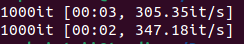

# Homework 4: Cassandra interaction through python code

## Instructions on running:

Clone the repository
```bash
git clone git@github.com:sophmintaii/big-data-processing-course.git
cd big-data-processing-course
git checkout hw4-cassandra-interaction-python
```

Make sure you are in the project directory before running the following commands.

1. Running the cluster
```bash
bash scripts/run-sluster.sh
```

2. Creating the keyspace with DDL commands
```bash
bash scripts/create-keyspace.sh
```

3. Write the data from the .tsv file to the database.
Make sure that the .tsv file is in the same directory.
```bash
bash scripts/write-data.sh
```
You should get an output like this:



4. Building a Docker container
```bash
bash scripts/run-rest.sh
```

5. Using the app to select data (examples)

[select all the reviews on the product with product_id=015602943X](http://127.0.0.1:5000/reviews_product_id/015602943X)
```json
[{"review_body": "Beatifully written, moving and very original love story - with additional twists of philosophy and time traveling. For me, the most interesting part of the book was its alternative approach to time travel - something like living many lives simultaneosly, rather than traditional \\\\\\\\\"what if\\\\\\\\\" approach. Made me wonder - and think."}]
```

[select all the reviews on the product with product_id=015602943X and star_rating=5](http://127.0.0.1:5000/reviews_product_id_star_rating/015602943X/5)
```json
[{"review_body": "Beatifully written, moving and very original love story - with additional twists of philosophy and time traveling. For me, the most interesting part of the book was its alternative approach to time travel - something like living many lives simultaneosly, rather than traditional \\\\\\\\\"what if\\\\\\\\\" approach. Made me wonder - and think."}]
```

[select all the reviews from the customer with customer_id=30501489](http://127.0.0.1:5000/reviews_customer_id/30501489)
```json
[{"review_body": "Since the 1992 presidential run of H. Ross Perot, there has been a growing awareness in American politics and society of the financial burden Social Security amd Medicare will have on future generations. This book is one of several to examine this issue and to propose solutions for it.

In short, this book explains how the demographic changes occurring within the US will make Social Security and Medicare very expensive for future generations to pay for. Specifically, as the ratio of workers to retirees gets smaller and smaller, each worker will have to contribute more and more of his/her income to provide for the benefits of the retiree. This book clearly illustrates this problem, and with some simple math, explains how this problem grows bigger with time. The book also looks at some of the possible and proposed solutions to this problem. These include raising the eligibility age for benefits, raising social security taxes, eliminating benefits for people above a certain income level, etc... The book examines the pros and cons of each of these suggestions, and their efficacy and political viability.

The book also forecasts what might happen to the US economy if Social Security is not reformed and how the govt might finance itself. Overall, a good book to read."}]
```
