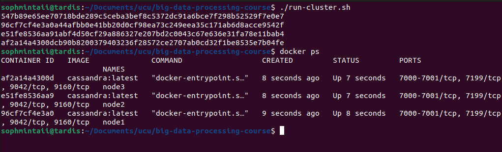
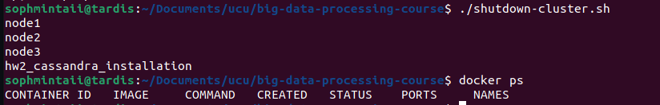

# Homework 2: Cassandra installation

## Instructions on running:

Clone the repository
```bash
git clone git@github.com:sophmintaii/big-data-processing-course.git
cd big-data-processing-course
git checkout hw2-cassandra-installation
```

Make sure you are in the project directory before running the following commands.

1. Running the cluster
```bash
bash run-sluster.sh
```
or
```bash
./run-cluster.sh
```
You should get an output like this:


2. Creating the keyspace with DDL commands
```bash
bash create-keyspace.sh
```
or
```bash
./create-keyspace.sh
```
You should get an output like this:


3. Manipulate the data with DML commands
```bash
bash manipulate-data.sh
```
or
```bash
./manipulate-data.sh
```

To select all the entries from the tables, run
```bash
bash select-data.sh
```
or
```bash
./select-data.sh
```

You should get an output like this:


5. Shutdown the cluster
```bash
bash shutdown-cluster.sh
```
or
```bash
./shutdown-cluster.sh
```
You should get an output like this:

