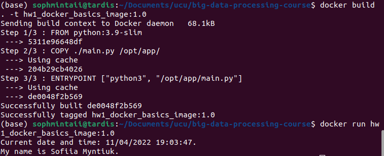
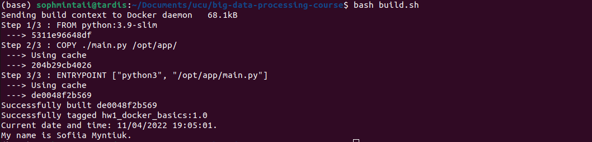
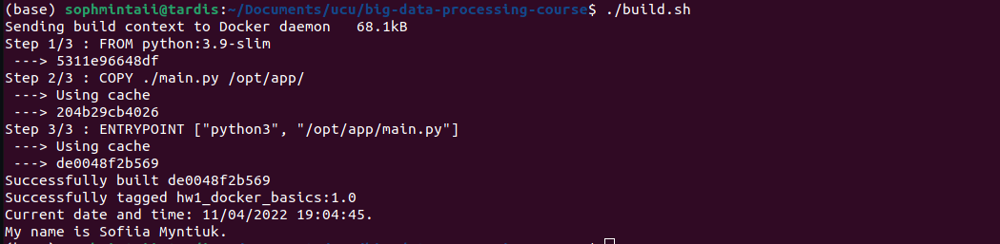

# Homework 1: Docker basics

## Instructions on running:

Clone the repository
```bash
git clone git@github.com:sophmintaii/big-data-processing-course.git
cd big-data-processing-course
git checkout hw1-docker-basics
```

Make sure you are in the project directory before running the following commands.

_Approach 1:_ running Docker commands by yourself 
```bash
docker build . -t hw1_docker_basics_image:1.0
docker run hw1_docker_basics_image:1.0
```
You should get an output like this:


_Approach 2:_ executing bash script
```bash
bash build.sh
```
or
```bash
./build.sh
```
You should get an output like this:


